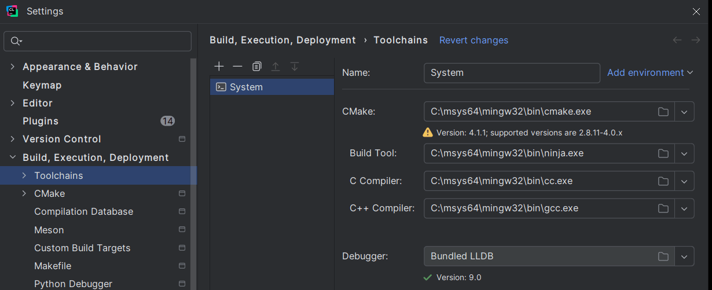
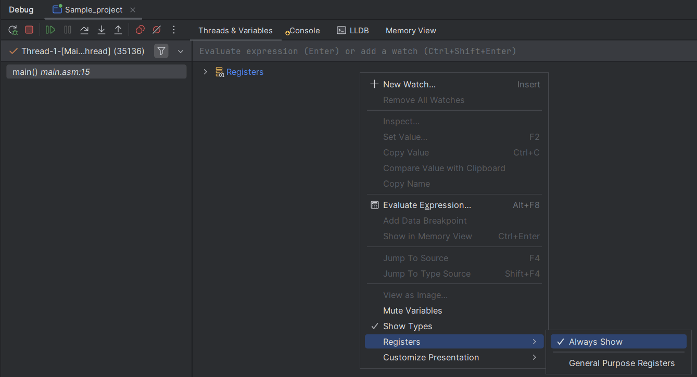

# MASM x86 Sample Project

A sample project demonstrating how to build and debug a 32-bit assembly application written in MASM syntax using `UASM` and the LLVM toolchain (`lld`, `lldb`).

## Dependencies

This project requires the following dependencies to be installed and available in your system's PATH, if possible choose x86 versions as Irvine is 32-bit library.

*   **[UASM](https://github.com/Terraspace/UASM):** A free MASM-compatible assembler. The project is configured to look for `uasm32.exe` in the `uasm257_x86` directory.
*   **[LLVM Project](https://github.com/llvm/llvm-project):** Provides the `lld` linker and.
*   **[MinGW-w64](https://www.mingw-w64.org/):** Provides C/C++ compilers needed by the toolchain.
*   **[CMake](https://cmake.org/download/):** The build system generator.
*   **[Ninja](https://github.com/ninja-build/ninja/releases):** A fast build tool used by the recommended CMake generator.

## Building and Running

This project uses CMake to automate the build process. Ensure you have CMake, MinGW, and LLVM in your system's PATH.

1.  **Create a build directory & Configure:**
    Create a directory for the build files, navigate into it, and run CMake to generate the build system.

    ```bash
    mkdir build
    cd build
    cmake .. -G "Ninja"
    ```

2.  **Build the executable:**
    From the `build` directory, use CMake's build command to compile and link the application.

    ```bash
    cmake --build .
    ```

3.  **Run the executable:**
    The final executable (`Sample_project.exe`) will be located in the `build` directory.

    ```bash
    .\Sample_project.exe
    ```

## Debugging in CLion

This project is specifically configured to allow for a seamless debugging experience directly within the CLion IDE. This is achieved by combining a MinGW toolchain with the LLDB debugger from an LLVM installation.

### 1. CLion Toolchain Configuration

To enable debugging, you must configure a new toolchain in CLion.

1.  Go to `File > Settings > Build, Execution, Deployment > Toolchains`.
2.  Click the `+` button and select `System`.
3.  Configure the toolchain with the following paths:
    *   **CMake:** Path to your CMake installation `cmake.exe`.
    *   **Build Tool:** Path to your build tool `ninja.exe`.
    *   **C Compiler:** Path to your MinGW `cc.exe`.
    *   **C++ Compiler:** Path to your MinGW `g++.exe`.
    *   **Debugger:** `Bundled LLDB`

Here is an example of a correct configuration:



### 2. CMake and LLDB Integration

The `CMakeLists.txt` file in this project is configured to:
*   Use `uasm32.exe` as the assembler.
*   Use `lld-link.exe` as the linker.
*   Generate the necessary debug information (`/Zi8` flag) for LLDB.

Because the toolchain is set up to use LLDB, CLion's default "Debug" button will automatically launch your application and attach the LLDB debugger, allowing you to set breakpoints, inspect memory, and step through your assembly code just as you would with C++ or other languages.

To always see registers in debug window go to `Threads & Variables`, right-click the variable view area, and set `Registers > Always Show`

